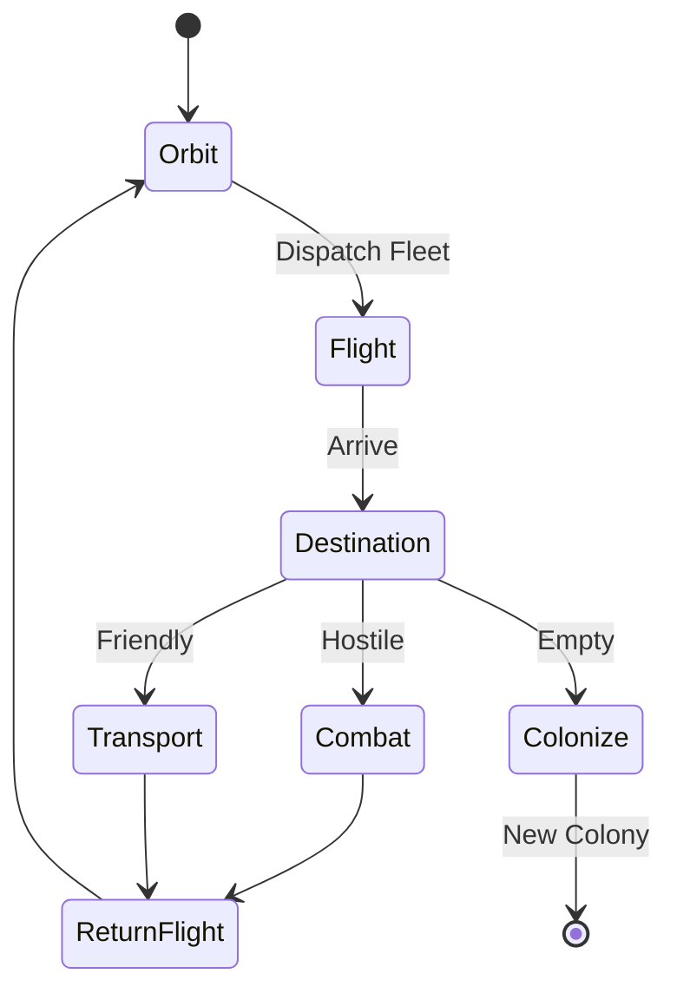

# Interstellar Travel

Navigating the vastness of space requires advanced propulsion and network infrastructure.

## 🌌 Travel Methods

### 1. Sublight (Impulse)
*   Used for local system travel (Planet to Moon, Planet to Debris Field).
*   Slow but energy efficient.

### 2. FTL (Warp/Hyperspace)
*   Used for travel between solar systems.
*   Consumes **Deuterium**.
*   Speed depends on **Engine Tech** level (Combustion < Impulse < Hyperspace).

### 3. Jump Gates
*   Instant travel between two owned Moons.
*   **Cooldown**: 1 hour.
*   **Restriction**: Cannot transport resources, only ships.

### 4. Stargate Network (Dialing)
*   Ancient network of 9-symbol addresses.
*   Allows instant travel to specific secret coordinates or event locations.
*   Requires finding **Glyph Sequences** (Artifacts).

## 🗺️ Galaxy View
The universe is a grid.
*   **Galaxy**: 1-9
*   **System**: 1-499
*   **Planet**: 1-15
*   **Coordinates**: `[1:102:8]` (Galaxy 1, System 102, Slot 8).

## UML: Navigation

