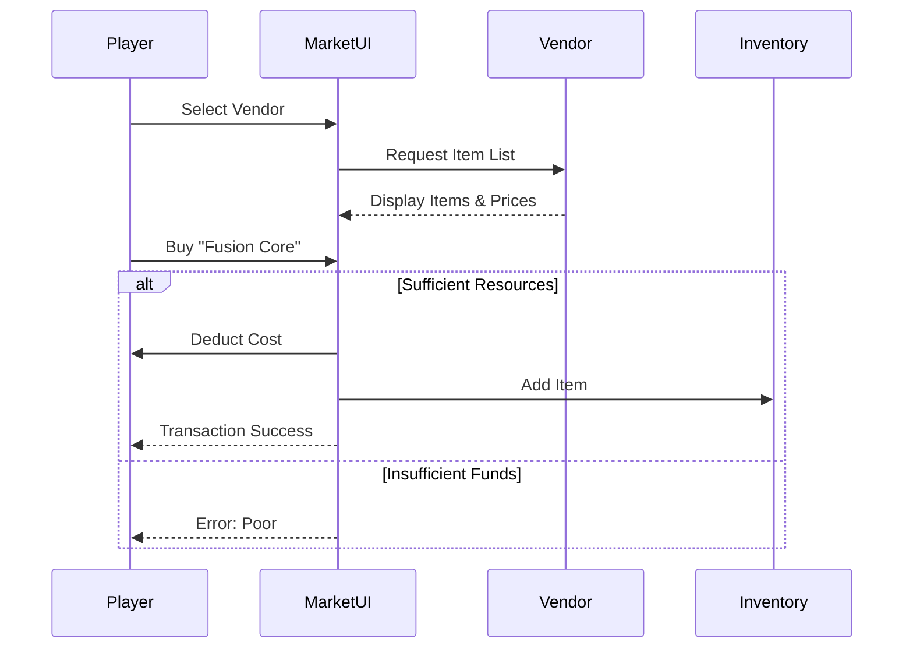

# Galactic Market

The Galactic Trade Network allows Commanders to buy and sell resources, specialized components, and contraband.

## 🏪 Vendors

### 1. Foreman Jaxon (Official Industrial)
*   **Specialty**: Construction Materials.
*   **Items**: Reinforced Plasteel, Bulk Metal.
*   **Currency**: Standard Resources.

### 2. Dr. Aris Thorne (Scientific)
*   **Specialty**: High-Tech Components.
*   **Items**: Quantum Circuits, Fusion Cores, Nanofiber.
*   **Use**: Required for advanced ship upgrades.

### 3. The Broker (Black Market)
*   **Specialty**: Illegal Goods & Alien Artifacts.
*   **Items**: Hacked Chips, Combat Stims, Precursor Relics.
*   **Risk**: Buying here helps avoiding taxes but carries risks (lore-wise).

## 💰 Inventory System
*   **Buy**: Exchange Metal/Crystal/Deuterium for Items.
*   **Sell**: Liquidate spare items for resources (50% value).
*   **Crafting**: (Planned) Use items to craft Commander Equipment.

## UML: Trade Flow

