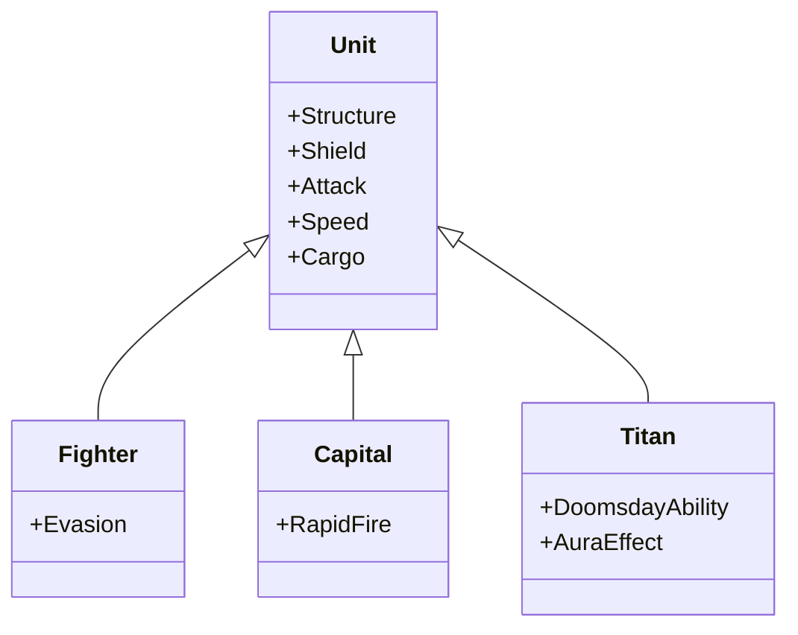

# Shipyard & Units

The **Shipyard** allows the construction of fleets, defenses, and ground vehicles.

## 🚀 Unit Classes

### Fighters
Small, agile, and cheap. Used in swarms.
*   **Viper (Light Fighter)**: Basic cannon fodder.
*   **Cobra (Heavy Fighter)**: Better armored.
*   **Wraith (Interceptor)**: Space superiority fighter.

### Capital Ships
The heavy hitters of the fleet.
*   **Hammerhead (Cruiser)**: Anti-fighter specialist.
*   **Leviathan (Battleship)**: The backbone of the line.
*   **Reaper (Battlecruiser)**: Capital ship hunter.
*   **Obliterator (Destroyer)**: Anti-defense platform.
*   **Devastator (Bomber)**: Planetary bombardment.

### Super Capital
Massive strategic assets.
*   **Mothership**: Mobile command center.
*   **Death Star (Planet Killer)**: Capable of destroying moons.

### 🛡️ TITANS
The ultimate pinnacle of naval engineering. Requires **Megastructure Engineering**.
*   **Avatar (Prometheus Class)**: Doomsday beam platform. High Attack.
*   **Erebus (Atlas Class)**: Fleet support and tank. High Shield/Armor.
*   **Ragnarok (Hyperion Class)**: Kinetic artillery platform. Balanced.

### Civilian
Support and logistics.
*   **Hermes (Small Cargo)**: Fast transport.
*   **Hercules (Large Cargo)**: Bulk transport.
*   **Exodus (Colony Ship)**: Settles new worlds.
*   **Scavenger (Recycler)**: Harvests debris fields.
*   **Seeker Drone (Probe)**: Espionage.

## 🏗️ Construction Queue
*   Units are built in batches.
*   Construction time reduces with **Shipyard Level** and **Nanite Factory**.
*   Queue is processed serially (one batch after another).

## UML: Class Relationships

