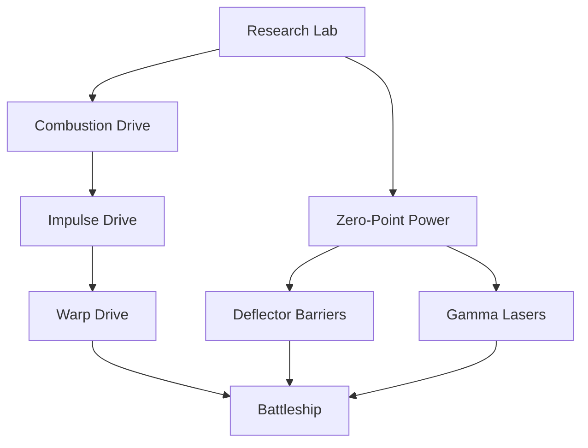

# Technology & Research

Science is divided into three distinct branches, inspired by Stellaris. Research is performed in the **Research Lab**.

## 🔬 Branches

### 1. Physics (Blue)
Focuses on energy, computing, and fundamental particles.
*   **Key Techs**:
    *   **Zero-Point Power**: Unlocks advanced reactors.
    *   **Gamma Lasers**: Increases energy weapon damage.
    *   **Positronic Computing**: Improves fleet coordination.
    *   **Graviton Theory**: Required for Death Stars.

### 2. Society (Green)
Focuses on biology, statecraft, and psionics.
*   **Key Techs**:
    *   **New Worlds Protocol**: Allows colonization of more planets.
    *   **Quantum Encryption**: Improves Espionage.
    *   **Intergalactic Research Network**: Links labs across planets to speed up research.

### 3. Engineering (Orange)
Focuses on materials, propulsion, and industry.
*   **Key Techs**:
    *   **Nanocomposite Armor**: Increases ship hull strength.
    *   **Impulse / Warp Drives**: Increases ship speed.
    *   **Megastructure Engineering**: Required for Titan-class ships.

## 🧪 Research Logic

*   **Requirement**: Research Lab.
*   **Cost**: Increases exponentially with each level (`Base * 2^Level`).
*   **Interdependencies**: Advanced ships require specific levels of multiple technologies (e.g., Battleship requires Warp Drive 4 + Hyperspace Tech 3).

## UML: Tech Tree Example

