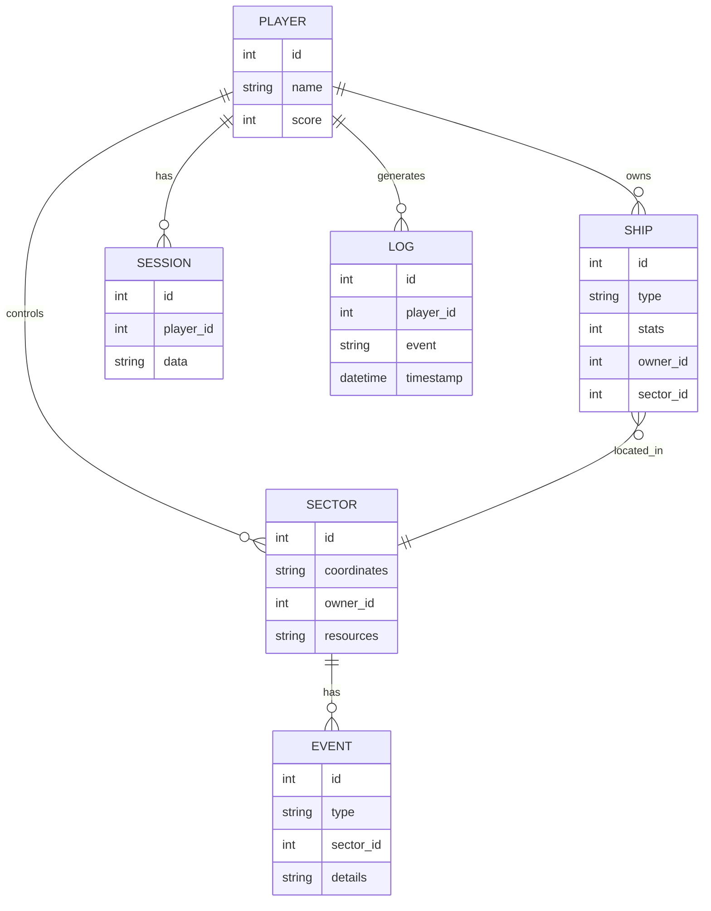

# Xenoberage Core ER Diagram

```mermaid
erDiagram
  PLAYER ||--o{ SHIP : owns
  PLAYER ||--o{ SECTOR : controls
  SHIP }o--|| SECTOR : located_in
  SECTOR ||--o{ EVENT : has
  PLAYER ||--o{ SESSION : has
  PLAYER ||--o{ LOG : generates
  SHIP {
    int id
    string type
    int stats
    int owner_id
    int sector_id
  }
  PLAYER {
    int id
    string name
    int score
  }
  SECTOR {
    int id
    string coordinates
    int owner_id
    string resources
  }
  EVENT {
    int id
    string type
    int sector_id
    string details
  }
  SESSION {
    int id
    int player_id
    string data
  }
  LOG {
    int id
    int player_id
    string event
    datetime timestamp
  }
```

This ER diagram represents the core entities and relationships in the Xenoberage game logic, suitable for both backend and future TypeScript integration.
